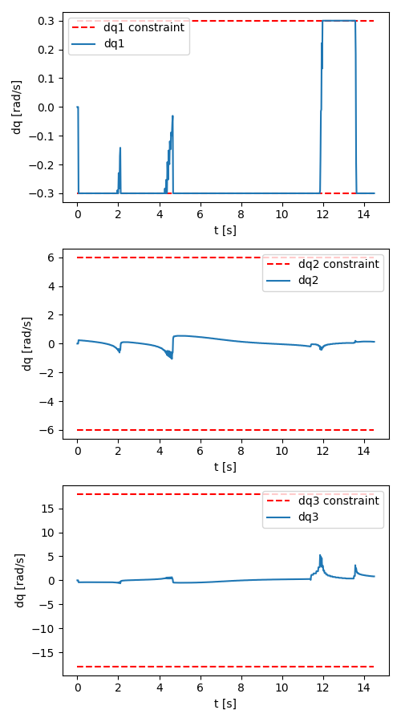
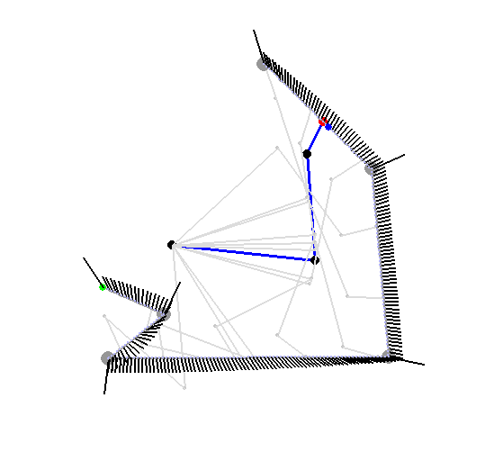

Install requirements with `pip install -r requirements.txt`

Run `main.py` to see the robot arm follow the trajectory.  
You can modify the trajectory following the printed instructions.
The path is consistently followed and the velocity constraints are satisfied:

Example of the simulator:

I tried an iterative approach but couldn't finish it yesterday. It was a bit more work then I though :/